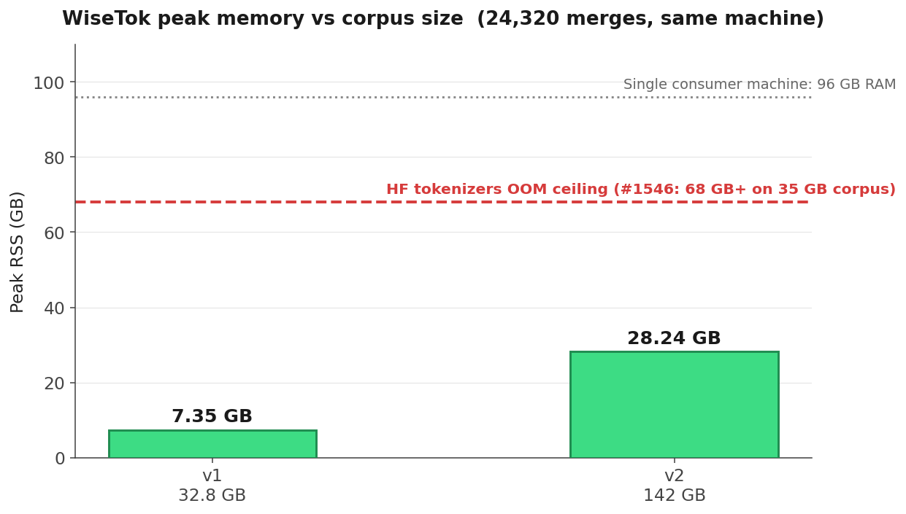

# WiseTok

[](https://pypi.org/project/wisetok/)
[](https://crates.io/crates/wisetok)
[](LICENSE)
[](https://pypi.org/project/wisetok/)

**A BPE tokenizer trainer that doesn't OOM.**

Train a GPT-style BPE tokenizer on **142 GB** of text. **Peak RSS: 28.24 GB.** Single consumer machine.

HuggingFace `tokenizers` OOMs on 35 GB with 780 GB of RAM available. This bug has been [open since 2020](https://github.com/huggingface/tokenizers/issues/422). WiseTok fixes it.



---

## The five-year-old bug

Open issues on `huggingface/tokenizers`:

- **[#1681](https://github.com/huggingface/tokenizers/issues/1681) (Nov 2024)** — 20 GB of text. **2 TB of RAM.** OOM at the merge phase. The user asks how OpenAI and HuggingFace train their own tokenizers at scale. No answer.
- **[#1546](https://github.com/huggingface/tokenizers/issues/1546) (Jun 2024)** — 35 GB / 15M docs on **780 GB RAM**. OOM after 1+ hour, in the merge phase.
- **[#994](https://github.com/huggingface/tokenizers/issues/994) (May 2022)** — dozens of GB on ~180 GB RAM. OOM. Repost of an issue from 2020.
- **[#655](https://github.com/huggingface/tokenizers/issues/655) (Mar 2021)** — 187 GB Spanish text on 500 GB RAM. Could only ingest 250 of 5,500 files before OOM.
- **[#422](https://github.com/huggingface/tokenizers/issues/422) (Sep 2020)** — 5.1 GB Japanese Wikipedia on 64 GB RAM. OOM.

Five years. Corpus sizes from 5 GB to 187 GB. Machines from 64 GB to 2 TB. Same crash. Either you have access to OpenAI/Meta-tier internal tooling, or you subsample your data and accept a worse tokenizer.

## What WiseTok does

WiseTok solves this with a **scan-based merge mode**.

Standard BPE trainers keep an inverted index mapping every symbol pair to every word that contains it, so each merge can be applied in O(affected words). That index is what blows up your RAM — it grows with **unique pre-tokens × pre-token length**, not with available RAM.

WiseTok drops the index. When a winning pair is selected, we do one linear pass over the (deduplicated, count-aggregated) word table to find and apply it. You trade some per-merge speed for **bounded memory**.

## It scales with unique words, not corpus size

Two real runs on the same consumer machine, same vocab size (24,320 merges):

|              | v1          | v2              |
| ------------ | ----------- | --------------- |
| Corpus       | 32.8 GB     | **142 GB**      |
| Unique words | 26.3 M      | 98.0 M          |
| Aggregation  | 14 min      | 67 min          |
| Merge        | 22 min      | 91 min          |
| **Total**    | 36 min      | **2h 43m**      |
| **Peak RSS** | **7.35 GB** | **28.24 GB**    |
| Merges       | 24,320      | 24,320          |

Corpus grew 4.3×. Unique words grew 3.7×. **Peak RSS grew 3.8×** — RAM scales with vocabulary work, not corpus size. That's exactly the property HF tokenizers loses when it adds the positions index. Both runs would OOM HF tokenizers on the same hardware (96 GB).

## The tokenizer is actually good

A **24K-vocab** WiseTok tokenizer trained on the 142 GB corpus, vs `tiktoken`'s `cl100k` (GPT-3.5/4, 100K vocab) and `o200k` (GPT-4o, 200K vocab). Higher chars/token = better compression.

| Category         | WiseTok 24K | cl100k 100K | o200k 200K |
| ---------------- | ----------- | ----------- | ---------- |
| C                | 2.84        | 3.51        | 3.49       |
| C++              | 3.16        | 4.01        | 3.93       |
| Java             | 3.99        | 5.05        | 4.78       |
| JavaScript       | 3.14        | 3.95        | 3.86       |
| Python (general) | 3.68        | 4.44        | 4.41       |
| Math/Python      | 2.63        | 3.11        | 3.10       |
| Markdown         | 3.12        | 3.80        | 3.82       |
| Prose            | 3.66        | 4.56        | 4.64       |
| HTML/CSS         | 2.67        | 3.41        | 3.40       |

WiseTok 24K runs **within 12–25% of cl100k on most code categories** — with a **4× smaller vocabulary**. Prose lags more (3.66 vs 4.56) because the corpus is code-heavy by design; tokenizer quality on a category tracks data mix, not the algorithm.

The point isn't that a 24K WiseTok beats `cl100k` (it doesn't, and it shouldn't at 1/4 the vocab). The point is that you can now train your **own** tokenizer matched to your **own** data distribution, on a laptop, in under three hours.

## Install

```bash
# Python (recommended for most users)
pip install wisetok

# Rust CLI
cargo install wisetok

# From source
git clone https://github.com/EzeLLM/WiseTok && cd WiseTok
maturin develop --release         # Python module
cargo build --release --bin wisetok   # CLI binary
```

See [INSTALL.md](INSTALL.md) for platform notes and troubleshooting.

## CLI: training a tokenizer

The `wisetok` binary has two subcommands: `train` and `validate`.

### Input: line-delimited text files

WiseTok reads input as **one sequence per line**, across one or more text files. A directory of `.txt` shards, a JSONL stripped to one field, a glob — anything that produces lines on stdin works:

```bash
# pre-flatten a directory of shards to plain text (one doc per line)
find corpus/ -name '*.jsonl' | xargs -I{} jq -r '.text' {} > corpus.txt

# or pass shards directly
wisetok train --files corpus/shard-*.txt --vocab-size 50000 --output tokenizer/
```

### One-shot training (aggregate + merge + export)

```bash
wisetok train \
  --files corpus/*.txt \
  --vocab-size 50000 \
  --output tokenizer/ \
  --pre-tokenizer gpt4+digits \
  --special-preset code \
  --merge-mode auto \
  --format hf,tiktoken \
  --verbose
```

Flags:

| Flag | Default | Description |
| --- | --- | --- |
| `--files` | (required) | One or more input files. Read line-by-line; each line is one sequence. |
| `--vocab-size` | required to merge | Target vocab size = 256 + num\_merges. Omit to aggregate only. |
| `--output` | required to merge | Output directory for the trained tokenizer. |
| `--pre-tokenizer` | `gpt4+digits` | Pre-tokenizer: `gpt4`, `gpt4+digits`, `regex:<pattern>`, `regex+digits:<pattern>`. |
| `--special-tokens` | (none) | Repeatable explicit special tokens, e.g. `--special-tokens "<\|endoftext\|>"`. |
| `--special-preset` | (none) | `code` or `chat` — adds a curated bundle. Mutually exclusive with `--special-tokens`. |
| `--reserve` | `0` | Reserve N placeholder tokens (`<\|reserved_0\|>` ...). |
| `--min-freq` | `2` | Drop chunks below this count before merging. |
| `--merge-mode` | `auto` | `full` (indexed, fast on small corpora), `scan` (memory-bounded), `auto` (picks based on corpus size). |
| `--ram-limit` | (none) | Approximate RAM ceiling, e.g. `64GB`. One-shot warning when exceeded. |
| `--threads` | 80% of cores | Rayon worker threads. |
| `--format` | `hf,tiktoken` | Output formats. Comma-separated. |
| `--agg-file` | (none) | Save/load aggregation. See "two-phase training" below. |
| `--buffer-size` | `8192` | Streaming aggregator buffer. |

### Two-phase training (ingest once, retrain many)

The slow part of training is the aggregation pass over your corpus. With `--agg-file` you can save the aggregation, then re-run merges with different vocab sizes / `min_freq` without re-scanning the corpus:

```bash
# Phase 1 — aggregate the corpus (no --vocab-size)
wisetok train --files corpus/*.txt --agg-file corpus.agg

# Phase 2 — merge from the .agg, vary vocab size freely
wisetok train --agg-file corpus.agg --vocab-size 32000 --output tok-32k/
wisetok train --agg-file corpus.agg --vocab-size 50000 --output tok-50k/
wisetok train --agg-file corpus.agg --vocab-size 100000 --output tok-100k/
```

### Output: a directory you can drop into any stack

`--output tokenizer/` produces:

```
tokenizer/
├── tokenizer.json          # HuggingFace format — drop into transformers
├── tokenizer_config.json   # HuggingFace tokenizer config
├── tiktoken.bpe            # mergeable_ranks for tiktoken.Encoding
└── tiktoken.json           # pattern + special_tokens sidecar
```

Use it with `transformers`:

```python
from transformers import PreTrainedTokenizerFast
tok = PreTrainedTokenizerFast(tokenizer_file="tokenizer/tokenizer.json")
tok.encode("hello world")
```

Or `tiktoken`:

```python
import json, tiktoken, base64
with open("tokenizer/tiktoken.json") as f: meta = json.load(f)
ranks = {}
for line in open("tokenizer/tiktoken.bpe"):
    b64, rank = line.split()
    ranks[base64.b64decode(b64)] = int(rank)
enc = tiktoken.Encoding(name="wisetok", pat_str=meta["pattern"],
                        mergeable_ranks=ranks, special_tokens=meta["special_tokens"])
```

### `wisetok validate`

```bash
wisetok validate --tokenizer tokenizer/ --test-files test/*.txt
```

Smoke-tests that `tokenizer.json` is loadable and reports test-corpus stats. (Full encode/round-trip validation is in the Python module — see `wisetok.Tokenizer.encode` / `decode`.)

## Python API

```python
import wisetok

tok = wisetok.Tokenizer()
tok.train_from_iterator(open("corpus.txt"), vocab_size=50000)

ids = tok.encode("hello world")
tok.decode(ids)

# Export to tiktoken's mergeable_ranks
ranks = tok.get_mergeable_ranks()
```

## Prior work

The aggregation idea — running BPE on a frequency dictionary of unique pre-tokens — is from Sennrich et al. (2016), the original BPE paper. Modern trainers kept the aggregation but added a positions index to make merges fast, and that's what made memory unbounded.

- **Sennrich et al. (2016)** — BPE for NLP. Aggregation concept.
- **[Karpathy's rustbpe](https://github.com/karpathy/rustbpe)** (from nanochat) — the fork base. Fast, correct streaming aggregation in Rust.
- **Morgan (2024), BatchBPE** — same problem (consumer hardware), pure Python, uses a frequency cutoff to drop rare chunks. Doesn't solve the merge-phase OOM.
- **Reddy et al. (2025), "How Much is Enough?" (ICML 2025)** — trained BPE on 900 GB by pre-aggregating chunk counts. Code not public.

Everyone who hit the merge-phase OOM previously either subsampled (Reddy, BatchBPE, SentencePiece's `input_sentence_size`) or had access to a high-memory cluster. WiseTok eliminates the positions index and runs the merge phase in bounded memory regardless of corpus size. If there's prior work that does this, open an issue and I'll cite it.

## What's in WiseTok

WiseTok extends rustbpe with the production pieces needed to train at scale:

- **Scan merge mode** — the headline. Memory-bounded merge loop.
- **Phase-separated training** — ingest writes a compact `.agg` file; the merge phase streams from disk. Re-train vocabularies without re-scanning the corpus.
- **HuggingFace `tokenizer.json` export** — full byte-level encoder, drop-in for `transformers`.
- **`wisetok` CLI** — `train` / `validate`, progress bars, peak-RSS reporting.
- **Composable pre-tokenizers** — regex / digit-splitting / sequenced pipelines.
- **Special tokens registry** with code/chat presets, wired through aggregation, encoding, and HF export.
- **`min_frequency`** filtering in the merge loop.
- **i32 → i64 counts** — closes a real overflow on multi-billion-pair corpora.
- **Background RSS sampler** — measured memory claims, not asserted ones.

## License

MIT. Inherits from rustbpe (MIT, © Andrej Karpathy).
